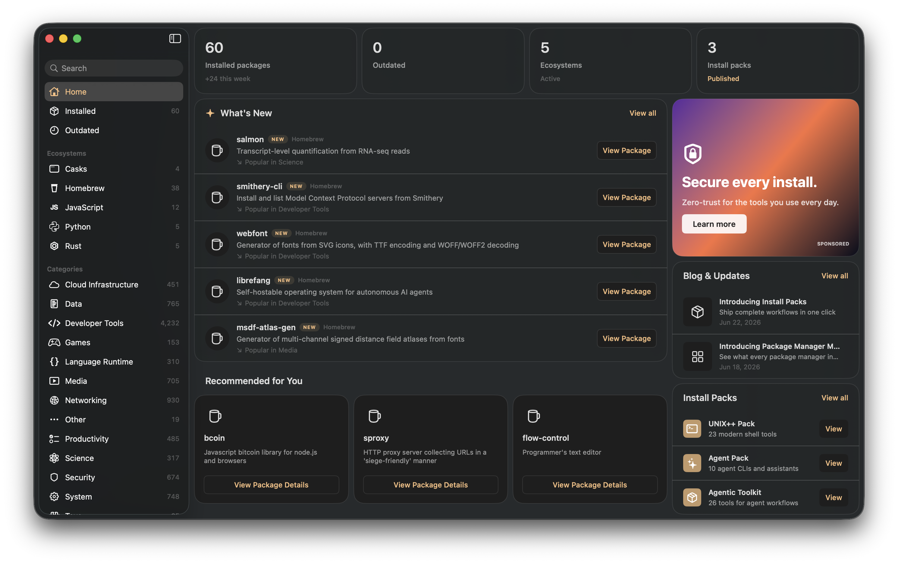
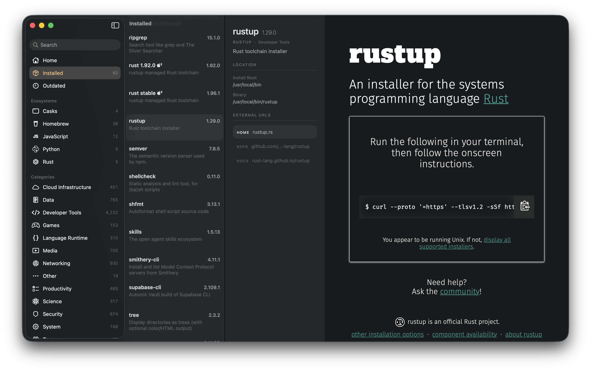

# Package Manager Manager

The time when one package manager was all you needed is long gone. pkg⋅mgr²
inventories your package managers and their packages, so you can see what you
have, what’s outdated, and what’s taking up space.

Use whatever you want without compromising visibility into what’s going on.

> [!TIP]
> No need to remember to `npx ***@latest` anymore. We update `npx`’d stuff too.

## Quickstart

```sh
brew install --cask mxcl/made/package-manager-manager
```

> No brew? [Download the `.dmg` from `./releases/`](https://github.com/mxcl/pmm/releases/latest).



&nbsp;

## Manage Your Other Macs

pkg⋅mgr² can update and uninstall packages on any Mac you already reach over
SSH, including Macs on your local network or Tailscale network.

1. Install Package Manager Manager in `/Applications` on each Mac.
2. Make sure SSH works non-interactively and the host key is trusted:

   ```sh
   ssh pangolin true
   ```

3. Choose **Package Manager Manager → Add / Edit Hosts…** and add the SSH host
   or an alias from `~/.ssh/config`.

Each Mac gets its own Installed and Outdated sections in the sidebar. You can
update one package, update everything outdated, or uninstall a package from the
remote Mac.

pkg⋅mgr² uses OpenSSH directly. Your keys, agent, host aliases, and
`known_hosts` stay where they already live; the app stores no SSH credentials.


## What It Finds

pkg⋅mgr² currently inventories:

- Homebrew formulae and casks
- tools and runtimes installed with `mise`
- global npm packages
- npx cache entries
- Skills packages installed with `skills` or `npx skills`
- `uv tool` tools and `uv` Python installs
- `uvx` cached environments
- `cargo install` binaries
- `rustup` and installed Rust toolchains

It also pulls package summaries, categories, URLs, and latest-version metadata
where the project has a source for it. If metadata is missing, the package still
shows up. It just looks less informed.

## Adding New Package Managers

Get your agent to add new package managers and give us a PR.

> [!NOTE]
>
> We want to support everything! Yes! Everything!

### Instructions to Agents

Keep new manager support boring and off the main thread. The menu bar helper
runs `PackageScanner.inventory(database:)` in the background, writes a
`PackageHostSnapshot`, and the main app renders that snapshot. Do not add package
manager scans, network loads, or shell commands to SwiftUI views or main-window
models.

Checklist:

- Add the manager to `PackageManagerKind` in `Sources/PMMCore/Models.swift`.
- Add one `scanX(database:)` method to `Sources/PMMCore/PackageScanner.swift`
  and call it from `inventory(database:)`. Return `[]` when the tool is missing
  or the manager has no local state.
- Build `ManagedPackage` values with stable `identifier` prefixes, readable
  `displayName`, `installedVersion`, optional `latestVersion`, and install or
  binary paths when cheap to find.
- Wire update/uninstall only when the native command is obvious:
  `PackageUpdater`, `PackageUninstaller`, and their `supports(_:)` methods.
  Inventory-only support is fine.
- Put the manager in a sidebar group in `MainWindowModel.swift` and give it a
  dashboard SF Symbol in `MainWindowDashboardView.swift`.
- Map it in `PackageDossierClient.provider(for:)` only if AutomIC Vault has a
  matching provider.
- Update the README lists under "What It Finds" and "Updating and Removing".
- Add focused tests beside the touched code: scanner parsing in
  `PackageScannerTests`, action commands in `PackageUpdaterTests` or
  `PackageUninstallerTests`, and UI grouping in `MainWindowModelTests` when a
  new section changes.

## Updating the Discover Feed

The hosted feed is generated by one reentrant command:

```sh
./scripts/update-discover-feed
```

An automation should keep following the command's status until it finishes:

- `PMM_FEED_STATUS=NEEDS_AGENT` — follow the printed research prompt, write
  `.feed-work/response.json`, then run the same command again.
- `PMM_FEED_STATUS=COMMITTED` — the validated feed was committed; push the
  commit normally to publish it through GitHub Pages.
- `PMM_FEED_STATUS=NOOP` — no new packages, stale recommendations, or due
  editorial need work.
- `PMM_FEED_STATUS=ERROR` — correct the reported response problem and rerun;
  the previous feed remains untouched.

Use `./scripts/update-discover-feed --check` to validate the checked-in feed
without network access and `--self-test` to exercise the complete handoff and
commit flow with fixtures.

The generator publishes two contracts. `www/feed/v1.json` remains the rolling
compatibility snapshot. `www/feed/v2.json` is the newest page of an append-only
archive: every editorial, new-package shelf, recently-updated shelf, and materially changed
recommendation shelf is kept as a self-contained block. Each editorial publication
is followed by For You, New Packages, and Recently Updated snapshots before the next
story. For You snapshots contain at most ten cards and rotate through the 24-card
recommendation pool across later sections. A page holds at most 20
blocks; when it fills, the generator freezes it under `www/feed/v2/pages/` and
links to it with `nextPageURL`. Clients can therefore load older pages as the
human scrolls without needing historical package dictionaries or a server.

Editorial bodies contain 600–1,000 words of Markdown with at least three `##`
subheadings. Each editorial also carries two to four related package cards,
including its primary package, so the reader ends with working Details and
Install actions rather than a dead end.

Feed v2 is script-owned. Do not rewrite frozen pages, IDs, package metadata, or
install URLs by hand. A normal feed commit may contain `www/feed/v1.json`,
`www/feed/v2.json`, new files below `www/feed/v2/pages/`, and referenced artwork.

## Caveats

pkg⋅mgr² shells out to your package managers. It does not replace them, normalize
their data perfectly, or pretend their caches are a coherent database.

Homebrew metadata requires `brew update` in the helper refresh path. Network
metadata is best-effort; local inventory should still work when that data is
unavailable.

Remote management requires a compatible version of Package Manager Manager in
`/Applications` on the other Mac. Interactive SSH passwords and first-connection
host-key prompts are not supported inside the app; connect once in Terminal
before adding the host.
